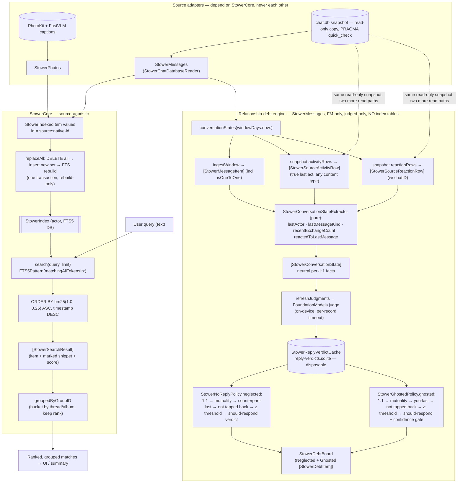
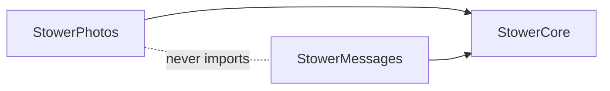

# Stower — Architecture at a glance

Two diagrams: **how a query flows through the system today**, and **the tables**.
For the full per-table column detail and ownership/status notes, see
[`Docs/DataModel.md`](Docs/DataModel.md); this file is the bird's-eye view.

## System flow — ingest, query, and the relationship-debt engine



The relationship-debt engine is **FoundationModels-only** and **judged-only**: a
conversation reaches the Neglected or Ghosted list only once the on-device model
has judged it and a trusted verdict is cached — unjudged conversations stay
invisible, and there is **no heuristic fallback**. On a Mac that can't run the
model the engine throws `languageModelUnavailable(reason)` (checked at startup via
`modelAvailability()`, before `loadDebtBoard` opens `chat.db`); the app routes to
an onboarding or unsupported screen rather than degrading to a heuristic board.
`loadDebtBoard` returns at structural speed from the cache and never runs the
model; `refreshJudgments` is the background pass that judges and backfills the
cache, reporting `judged`/`failed`/`total` and which chats changed.

## The tables (condensed)

There is **no database literally named "index."** The persistent search database
is the one the `StowerIndex` actor manages (caller-supplied file path; in-memory
in tests) and it holds the three tables below. The `chat.db` **snapshot** is a
throwaway temp copy of Apple's data. `llm_trace` is design-only (not built). The
relationship-debt engine writes no index tables; its only state is the disposable
`StowerReplyVerdictCache` (`reply-verdicts.sqlite`), which holds nothing but input
hashes and model verdicts and can be deleted at any time.

Each table's first row is a **LIFECYCLE** marker:
- `PERSISTENT_REBUILDABLE` — survives across runs; erased + rebuilt from sources on a `schema_version` bump.
- `TEMPORARY` — ephemeral file; deleted on release, swept after 1 day.
- `NOT_BUILT` — design anchor only.

```mermaid
erDiagram
    meta {
        LIFECYCLE _ "PERSISTENT_REBUILDABLE (StowerIndex DB)"
        text key   PK "schema_version"
        text value
    }
    item {
        LIFECYCLE _ "PERSISTENT_REBUILDABLE (StowerIndex DB)"
        text   id          PK "source:native-id"
        text   source
        text   text           "FTS weight 1.0"
        double timestamp      "tiebreak DESC"
        text   deep_link
        text   group_id       "grouping key"
        text   group_title    "FTS weight 0.25"
        text   metadata       "JSON"
    }
    item_fts {
        LIFECYCLE _ "PERSISTENT_REBUILDABLE (StowerIndex DB)"
        text text
        text group_title
    }
    snapshot_chat_db {
        LIFECYCLE _ "TEMPORARY — stower-msg-UUID/chat.db, deleted on release"
        note _ "read-only copy of Apple's chat.db (message/chat/handle/joins)"
    }
    item ||--|| item_fts : "external-content, bm25(1.0, 0.25)"
    snapshot_chat_db ..> item : "read by adapters → derived into"
```

> `meta` / `item` / `item_fts` are the **only persistent tables Stower owns**.
> `snapshot_chat_db` is Apple's data, temporary and read-only — its full columns
> (`message` / `chat` / `handle` / join tables) and the design-only `llm_trace`
> are in [`Docs/DataModel.md`](Docs/DataModel.md).

## The one-directional dependency rule



Arrows point **into** `StowerCore`. Nothing depends on the adapters, and the two
adapters never import each other — that's what keeps the future Photos-only iOS
app from ever linking the Messages code (`AGENTS.md` §Architecture rules).
