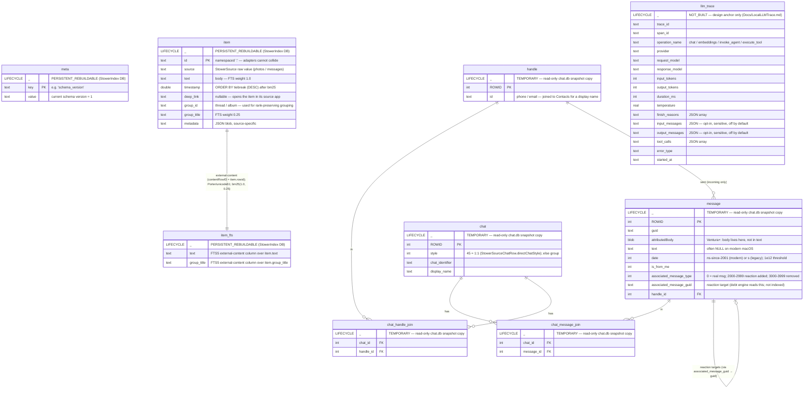

# Stower — Data Model

A map of every table Stower touches, grouped by **ownership** and **status**.
The point of the grouping is honesty: Stower *persists* two owned stores today —
the rebuildable search index and the precious drafts store (`drafts.sqlite`).
Everything else is either Apple's data we open read-only, or a design anchor not
yet built.

## Ownership / status legend

- **Owned + built** — Stower creates and writes this. The search index and the
  precious drafts store (`drafts.sqlite`).
- **External, read-only** — Apple's `chat.db`. We snapshot a copy and read it;
  we never write it. Columns shown are only the ones the adapter reads.
- **Design-only (not built)** — schema fixed on paper for forward-compat; no
  migration, no writer exists. See `Docs/LocalLLMTrace.md`.

Each entity's first row is a **LIFECYCLE** marker:
- `PERSISTENT_REBUILDABLE` — the `StowerIndex` database (caller-supplied file
  path; in-memory in tests). Survives across runs; erased and rebuilt from the
  sources on a `schema_version` change. There is **no DB literally named "index"** —
  this is just the database the `StowerIndex` actor manages.
- `TEMPORARY` — the `chat.db` **snapshot**: a throwaway copy at
  `…/stower-msg-<UUID>/chat.db`, deleted when the reader is released and swept
  after one day. Apple's schema, opened read-only.
- `PERSISTENT_PRECIOUS` — the `StowerDraftStore` database (`drafts.sqlite`). Holds
  the user's private per-conversation drafts: irreplaceable, never erased to
  recover. Migrations are additive-only and an unopenable file is quarantined aside
  (`…corrupt-<ts>`), never deleted — the opposite posture from the rebuildable index
  and the disposable verdict cache.
- `NOT_BUILT` — design anchor only; nothing creates or writes it.

> The relationship-debt engine (`StowerMessages`) adds **no tables to the search
> index**. Its conversation facts are a pure in-memory fold over `ingestWindow`
> items + a windowed reaction read on the *same* read-only snapshot. Its only
> persistent state is its own disposable cache, `StowerReplyVerdictCache`
> (`reply-verdicts.sqlite`), keyed by `(judge_version, message_guid)` with an
> `input_hash`. It stores **no plaintext and no long-form content** — only the
> input hash, the `expects_reply` boolean, the `0...1` confidence, and the
> `verdict_source` token. The cache is the trust boundary: a write rejects a
> malformed payload (non-finite or out-of-`0...1` confidence), and a read whose
> stored source token is unknown/garbled resolves to a **miss** (re-judged later)
> rather than defaulting to the trusted source. There is no heuristic verdict — a
> version bump simply erases the cache and the next refresh refills it. It is
> intentionally absent from the index diagram below; it owns no index table.

> **Owned + built, PRECIOUS:** `StowerDraftStore` persists the user's private
> per-conversation drafts in its own `drafts.sqlite` under `~/Library/Application
> Support/<folder>/`, where `<folder>` is `Stower` (Release), `StowerDebug`
> (Debug, real data), or `StowerDebugDemo` (Debug, demo data) — `StowerEnvironment`
> and `StowerMessagesStorageLocation` isolate the three so they never write into
> each other's files (PAR-62). One table, `draft`:
> `draft_key TEXT PRIMARY KEY`, `body TEXT NOT NULL`, `updated_at DATETIME NOT NULL`,
> `resolved_at DATETIME` (nullable). The `draft_key` is the conversation's normalized
> handle via `StowerDraftKey` (`email:<lowercased>` / `e164:<digits, no +>` /
> `raw:<handle>`), so a draft survives a chat-GUID flip on an SMS↔iMessage switch and
> a Contacts edit. It is a default rollback-journaled `DatabaseQueue` (NOT WAL — no
> `-wal`/`-shm` sidecars, only a transient `-journal` during a write) with
> `synchronous = FULL` pinned, so every committed change is fsync-durable. A
> blank/whitespace body deletes the row. Unlike the disposable verdict cache, it is
> **never erased**: migrations are additive-only (`stower-drafts-v1` creates the
> table; `stower-drafts-v2-resolved-at` adds the column via `ALTER TABLE`) and a
> corrupt file is quarantined aside (`…corrupt-<ts>`), never deleted. It is
> orthogonal to the engine — it never touches verdicts, ranking, the `inputHash`, or
> the index, and is intentionally absent from the index diagram below; it owns no
> index table.
>
> **`resolved_at` = the "mark as sent" soft-resolve (added `stower-drafts-v2`).**
> `NULL` = active (the draft shows everywhere it appears); a set timestamp = resolved
> — the row is **kept** (never deleted), so the resolve is reversible, but hidden from
> all three read surfaces. `StowerDraftStore.markSent(key:)` is an additive `UPDATE`
> (never routes through `deleteRow`, so the body a later `unmarkSent(key:)` restores
> survives); `unmarkSent(key:)` clears it back to `NULL`. `upsert(key:body:)` always
> writes `resolved_at = NULL`, so any body edit reactivates a previously-resolved
> draft. The three read surfaces that hide a resolved draft (`resolvedAt != nil`) —
> the Drafts tab (`StowerDraftCard`), the composer, and the inline row preview
> (`activeDraftPreview`) — filter in the app layer (`StowerBoardViewModelDrafts`),
> not in SQL: `all()` returns every row and the view model excludes resolved ones.

## How a query flows through these tables

1. **Ingest (rebuild-only).** An adapter (`StowerMessages` / `StowerPhotos`)
   reads its source and emits `StowerIndexedItem`s. `StowerIndex.replaceAll`
   flattens them to `item` rows, `DELETE`s all existing rows, inserts the new
   set, and runs FTS5 `rebuild` — all in one transaction. No incremental path
   in v1.
2. **Query.** `StowerIndex.search(query, limit)` builds an
   `FTS5Pattern(matchingAllTokensIn:)` (never raw FTS syntax), matches against
   `item_fts`, joins back to `item` by rowid, orders by `bm25(1.0, 0.25)` ASC
   then `timestamp` DESC, and returns `StowerSearchResult` (item + marked
   `snippet` + score).
3. **Group.** `StowerSearchResult.groupedByGroupID` buckets results by
   `group_id` while preserving rank — that's the thread/album view.

The `chat.db` tables feed step 1 only (and the debt engine's separate read);
`llm_trace` would wrap a future summarization step that does not exist yet.
