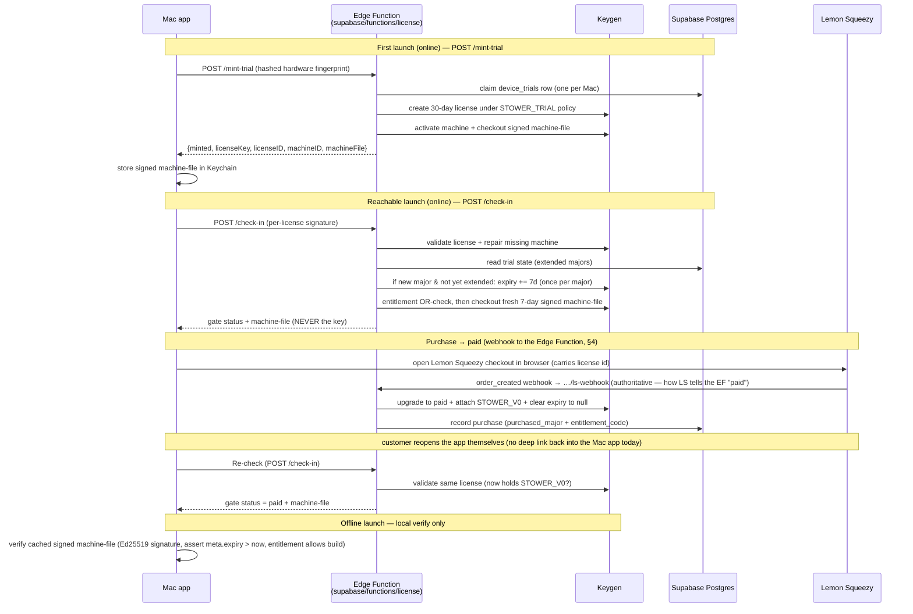

# Stower — License Lifecycle & Runtime Topology

> **What this doc is.** The runtime shape of Stower's licensing: who
> talks to whom, who is allowed to reason, and how a license moves through its life
> (trial → paid → offline). Customer-facing terms live in [`licensing.md`](./licensing.md);
> the seam-by-seam engineering contract lives in
> [`licensing-contract.md`](./licensing-contract.md). This doc is the **topology +
> lifecycle** view that sits above both, and is consistent with the contract
> (≥ v1.12) — it does not introduce a different model, it draws the picture.
>
> **This lifecycle is now as-built.** Plan B landed and wired the Mac app to the
> Edge Function (`/mint-trial`, `/check-in`, `/ls-webhook`, `/health`, built via
> Plan Beta). The wired gate is `StowerLicenseGate` (`StowerRootView.swift:89`),
> which mints on first run or runs a JC5-signed `/check-in`, with a signed offline
> fallback. The webhook + `/check-in` flow drawn below is live. The only remaining
> pre-sales work is G10 prod ops: the real Edge Function base URL and the real
> buyable Lemon Squeezy checkout URL.

**Version:** 1.3 · **Last updated:** 2026-07-01 · **Status:** **As-built (Plan B landed).** Brain = Supabase Edge Function (`supabase/functions/license/`); its `mint-trial` / `check-in` / `ls-webhook` / `health` routes are implemented (Plan Beta), and the Swift app is wired to them — the wired gate is `StowerLicenseGate` (mint-on-first-run + JC5-signed `/check-in` + signed offline fallback).

---

## 1. The locked decisions

These are firm (Emily, 2026-06-25). A plan or commit that contradicts one is wrong.

1. **The Mac app's only online licensing surface is the Edge Function base URL.**
   No direct Keygen calls, no direct Supabase Postgres calls. The Supabase Edge
   Function (`supabase/functions/license/`) is the single app-facing surface; the
   app talks only to it for online licensing.
2. **The Edge Function is the only component that reasons.** It owns all runtime
   license logic: mint trial, validate / check in, trial-extension math,
   machine-file checkout, and flipping a trial to paid. Keygen is the authority it
   calls; Supabase Postgres is the memory it reads/writes.
3. **Supabase is brain + state store.** The Edge Function (`supabase/functions/license/`)
   is the brain; Postgres (`device_trials`, `purchases`, `trial_extension_grants`)
   is the state store. There is **no separate Railway compute** — Railway was
   considered and superseded.
4. **The Lemon Squeezy webhook points at the Edge Function `…/ls-webhook`.** The
   `order_created` webhook is received by the **Edge Function**, which acts on it
   (upgrades the license to paid, attaches the major's entitlement, clears expiry,
   records the purchase). All licensing reasoning — webhook included — lives in the
   Edge Function.
5. **Keygen stays the sole license authority.** It mints, signs (Ed25519),
   validates, holds entitlements, and enforces `maxMachines`. The Edge Function
   never reimplements that — it orchestrates it. Keygen admin secrets live in the
   Edge Function env, never in the app binary.

---

## 2. The actors

| Actor | What it is | Allowed to reason? |
|-------|-----------|--------------------|
| **Mac app** (`Stower`) | The client. Calls the Edge Function when online; verifies a signed Keygen machine-file locally when offline. | No — it asks and enforces, it doesn't decide. |
| **Supabase Edge Function** (`supabase/functions/license/`) | The licensing brain. The only orchestrator. Serves `/mint-trial`, `/check-in`, `/ls-webhook`, `/health`. Receives the Lemon Squeezy webhook. Holds the Keygen admin token in its env. | **Yes** — all runtime license reasoning lives here. |
| **Keygen** (CE/cloud) | The license authority. Mints, validates, signs machine-files, holds entitlements, enforces `maxMachines`. | Authority only — it has no rules/scheduling engine. |
| **Supabase Postgres** | The state store the Edge Function reads/writes: `device_trials`, `purchases`, `trial_extension_grants`. | **No** — storage, not logic. The reasoning lives in the Edge Function. |
| **Lemon Squeezy** | Payment processor. Takes money, shows its own web confirmation (no deep link back into the Mac app), and sends `order_created` **to the Edge Function** (`…/ls-webhook`) — that webhook is how it tells Stower the payment succeeded. | No — payment only. |

---

## 3. Architecture (static shape)

```mermaid
flowchart LR
    App["Mac app (Stower)"] -->|online licensing only| EF["Edge Function<br/>(supabase/functions/license)"]
    App -.->|offline: verify signed<br/>machine-file locally| MF[("Keygen-signed<br/>machine file (on disk)")]
    EF -->|validate / activate /<br/>checkout machine-file /<br/>attach entitlement<br/>(admin token in EF env)| Keygen
    EF -->|read / write trial + purchase state| PG[("Supabase Postgres<br/>(state store)")]
    EF -->|+7d "latest major" signal| GH["GitHub releases"]
    Customer((Customer)) -->|checkout in browser| LS["Lemon Squeezy"]
    LS -->|order_created webhook<br/>…/ls-webhook<br/>(how LS tells the EF "paid")| EF
    Customer -.->|reopens the app manually<br/>(no deep link today)| App

    classDef store fill:#eee,stroke:#999,color:#333;
    class PG store;
```

Read the arrows: every online arrow from the app points at the **Edge Function** —
the app's single online edge. The Edge Function is the only thing that fans out to
Keygen, Supabase Postgres, and GitHub releases, and the only thing the Lemon
Squeezy `…/ls-webhook` hits. Supabase Postgres has **no inbound arrow except from
the Edge Function**, and the Keygen admin token lives only in the Edge Function —
never in the app binary. That's the "the Edge Function is the brain; the app talks
only to it" invariant made visual.

---

## 4. Purchase → paid: webhook to the Edge Function

> **Intended (Plan B), not as-built.** The steps below are the target webhook +
> `Re-check` flow. Today's shipping purchase is different: Lemon Squeezy emails a
> license key and the user pastes it into `StowerLicenseEntryView` (see the banner
> at the top). The Edge Function `/ls-webhook` itself is built; the app's
> participation in this flow is not.

A purchase becomes a paid license when the **Edge Function** receives the Lemon
Squeezy `order_created` webhook (at `…/ls-webhook`) and acts on it.

1. Customer clicks Buy → the app opens the Lemon Squeezy checkout in a browser,
   carrying the device's license id so the webhook can match the order to the
   license (the checkout id comes from `.trialEnded(licenseID:)` /
   `.upgradeRequired(licenseID:)`; there is no Edge Function "make a checkout URL"
   route).
2. Customer pays at Lemon Squeezy.
3. Lemon Squeezy sends `order_created` **to the Edge Function** (`…/ls-webhook`).
   The Edge Function verifies the HMAC signature, replay-checks the order, checks
   the variant is the paid variant, proves it minted the referenced license, then
   on the Keygen license:
   - swaps the policy to Paid and clears the license expiry to `null` (perpetual),
   - attaches the major's entitlement (`STOWER_V0`),
   - records the purchase row in Supabase Postgres (with `purchased_major` +
     `entitlement_code`).
   **This webhook is the authoritative mutation** — it is the only thing that
   flips trial → paid.
4. After paying, the customer **returns to the Mac app themselves.** Lemon Squeezy
   shows its own web confirmation; there is **no deep link back into the Mac app
   today** (a `stower://` return scheme that would auto-foreground the app is a
   future improvement, not built). The app never learns "paid" from the browser.
   Instead, the next time the app is open, its `Re-check` action calls the Edge
   Function (`/check-in`), which validates the same Keygen license; if the webhook
   has already attached `STOWER_V0`, the app advances off the paywall. Step 3's
   `order_created` webhook is exactly how Lemon Squeezy tells the Edge Function the
   payment succeeded — the app needs no redirect to find out.
5. If the webhook hasn't landed yet, `Re-check` leaves the user on the paywall;
   they press it again and it completes once the webhook has been processed.

Why the app re-checks instead of trusting the browser: a web confirmation page is
a UI event the user could reach without paying; the webhook is the signed,
server-to-server truth, and the only thing that flips trial → paid. Background
polling and a deep-link (`stower://`) return that would auto-advance the app are
deferred — for v0, `Re-check` is the manual trigger.

> Seam-level detail (endpoints, idempotency, `KEYGEN_V0_ENTITLEMENT` fail-loud)
> lives in `licensing-contract.md` §5b "Purchase webhook extension" and invariants
> I7 / I10. This section is the topology; the contract is the contract. The
> as-built handler is `handleWebhook` in `supabase/functions/license/handlers.ts`,
> wired in `index.ts`'s `…/ls-webhook` route.

---

## 5. Lifecycle (dynamic behavior over time)



The offline path never touches the network: the app trusts only a cached
Keygen-signed machine-file whose Ed25519 signature verifies, whose `meta.expiry`
is still in the future (TTL assertion), and whose entitlements allow the running
major. It cannot mint, extend, or flip to paid offline — those are Edge-Function-only
and require reachability.

---

## 6. Relationship to the contract & current drift

This doc is **consistent with `licensing-contract.md` (≥ v1.12)** — the webhook
targets the Edge Function there (vendor table, §5b, gap item **G8** "Webhook
attaches `STOWER_V0`"). Nothing in the contract needs to change for this doc.

The brain is now correctly **`supabase/functions/license/`** in both doc and code:
the Edge Function hosts `mint-trial`, `check-in`, `ls-webhook`, and `health`, and
the Lemon Squeezy webhook hits the Edge Function — exactly what decision #4
prescribes. (An earlier draft of this doc routed the brain and webhook through a
Railway service; **Railway was considered and superseded** — there is no separate
Railway compute.)

Topology and code now agree — Plan B wired the Mac-app half:

- **Swift gate (`StowerLicenseGate`, Plan B)** talks to the Edge Function's
  `/check-in` as the reachable-launch authority and verifies the cached signed
  machine-file offline. It is wired (`StowerRootView.swift:89`).
- **Purchase is webhook + Re-check.** The user buys on Lemon Squeezy; completion is
  signalled by the Edge Function `/ls-webhook` (not a pasted key), and the app
  re-checks via `/check-in` to pick up the upgraded license — there is no direct
  `/v1/licenses/activate` call anymore. (Contract §5a/§5b, now as-built, is
  canonical.)

`licensing.md` (customer-facing) now names the Edge Function and its routes
(`/mint-trial`, `/check-in`, `/ls-webhook`) and handler functions in its technical
parentheticals (§2, §4, §5), consistent with this topology — the app's only online
licensing surface is the Edge Function, which calls Keygen.

---

## 7. Open items

- **Plan Beta** (landed) made the Edge Function the brain: `mint-trial`,
  `check-in`, and the Lemon Squeezy `ls-webhook` are implemented in
  `supabase/functions/license/`, with Supabase Postgres as the state store.
- **Plan B** (open) is the Swift gate rewire: point the app at the Edge Function's
  `/check-in` as the reachable-launch authority and verify the cached signed
  machine-file offline. Tracked in `licensing-contract.md` §5c (gap items G12/G13)
  — not owned by this doc.

> **Diagrams.** The mermaid sources above are current. If stale rendered
> `.excalidraw`/`.png` exports of these diagrams exist, regenerate them from the
> updated mermaid via `/diagram` — do not hand-edit the binaries.
