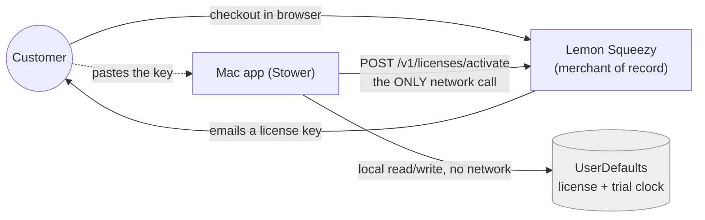
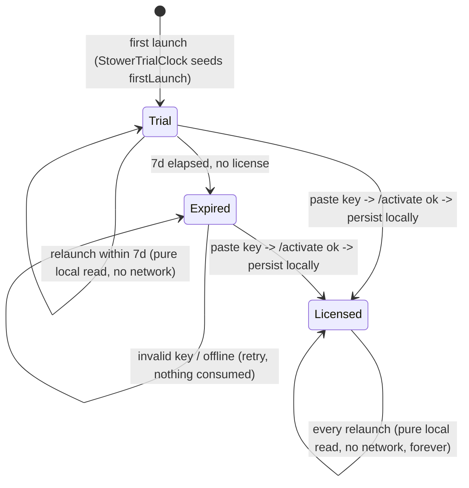

# Stower — License Lifecycle & Runtime Topology

> **What this doc is.** The runtime shape of Stower's licensing: who
> talks to whom, who is allowed to reason, and how a license moves through its
> life (trial → paid → offline). Customer-facing terms live in
> [`licensing.md`](./licensing.md); the seam-by-seam engineering contract lives
> in [`licensing-contract.md`](./licensing-contract.md). This doc is the
> **topology + lifecycle** view that sits above both, and is consistent with
> the contract (≥ v2.0) — it does not introduce a different model, it draws
> the picture: the app talks directly to Lemon Squeezy, once, to activate a
> key; everything else is a local read. There is no server of any kind.

**Version:** 2.0 · **Last updated:** 2026-07-02 · **Status:** As-built (client-only Lemon Squeezy activate-once flow).

---

## 1. The locked decisions

These are firm. A plan or commit that contradicts one is wrong.

1. **The Mac app's only online licensing surface is Lemon Squeezy's own
   `/v1/licenses/activate` endpoint.** No Stower-operated server, no Edge
   Function, no Keygen, no Supabase. The app calls Lemon Squeezy directly and
   only at activation time.
2. **There is no brain to orchestrate.** There is nothing left to reason on
   Stower's behalf — the app itself holds the whole (tiny) decision: read
   local state, and if the user pastes a key, ask Lemon Squeezy to verify it.
3. **Lemon Squeezy is the sole license authority AND the merchant of
   record.** It issues license keys, verifies them via `/activate`, enforces
   `activation_limit` server-side, and owns payments/tax/refunds/webhooks. The
   app never receives a webhook from it.
4. **No revocation, no re-check, ever.** Once a key activates, the app trusts
   the local store forever, offline. There is no `/validate` call and no
   periodic check-in of any kind.
5. **The trial is 100% local.** `StowerTrialClock` starts a 7-day window from
   a `UserDefaults` first-launch date on first read — no network call, no
   server-side "one trial per device" enforcement of any kind.

---

## 2. The actors

| Actor | What it is | Allowed to reason? |
|-------|-----------|--------------------|
| **Mac app** (`Stower`) | The whole system. Reads local license/trial state at launch; makes exactly one network call (`/activate`) when the user pastes a key. | Yes — it's the only thing left. |
| **Lemon Squeezy** | Payment processor AND license authority. Sells the product, issues license keys by email, verifies them via its public `/v1/licenses/activate`, enforces `activation_limit`. | Authority for "is this key valid," nothing else. |

There is no third actor. No Stower-operated backend exists.

---

## 3. Architecture (static shape)

Read the arrows: there is exactly one online arrow in the whole diagram — the
app's `/activate` call to Lemon Squeezy, made once, only when the user pastes
a key. Every other arrow is local (`UserDefaults`) or happens entirely outside
the app (the customer buying on Lemon Squeezy's own checkout page and
receiving the key by email). Nothing fans out anywhere else.

---

## 4. Purchase → paid: no webhook, the user pastes the key

The Lemon Squeezy model has **no webhook the app ever sees** — buying doesn't
flip anything on a server; the user pastes the key themselves:

1. Customer clicks Buy (gear menu, F3 banner, or the paywall) → the app opens
   the static Lemon Squeezy checkout URL (`StowerLicenseConfig.resolved.checkoutURL`)
   in the browser via `NSWorkspace.shared.open`. The app also sets a session
   flag (`boughtThisSession`) so returning to the app can show the F2 "Enter
   your license key" banner.
2. Customer pays at Lemon Squeezy. Lemon Squeezy emails them a license key —
   the app is never told this happened.
3. Customer returns to the app themselves (there is no deep link back) and
   pastes the key into `StowerLicenseEntryView` (reachable from the paywall,
   the gear menu's "Enter license key…," or the F2 banner).
4. The app calls `POST https://api.lemonsqueezy.com/v1/licenses/activate`
   with the key. Lemon Squeezy verifies it and enforces `activation_limit`
   itself; the app additionally checks the response's `meta.store_id`/
   `meta.product_id` against its own configured ids (I2) so a key for a
   *different* Lemon Squeezy product can't unlock Stower.
5. On success, the app stores the key + the returned `instance.id` locally
   (`StowerLicenseStore`) and never calls Lemon Squeezy again. The F1 "You're
   all set." alert confirms it.

There is no "webhook hasn't landed yet, try again" step — activation is
synchronous and complete the moment the user pastes a valid key.

---

## 5. Lifecycle (dynamic behavior over time)

The only online step in this entire diagram is the single `/activate` call
that moves `Trial`/`Expired` → `Licensed`. Every other transition —
including every relaunch of an already-licensed install — is a synchronous
local `UserDefaults` read (`StowerLicenseGating.licenseState(now:)`). There is
no offline/online distinction to reason about after activation, because
there is no further network call to distinguish: a licensed device behaves
identically online or offline, forever.

---

## 6. Relationship to the contract

This doc is consistent with `licensing-contract.md` v2.0 — same seam
(`StowerLicenseGating`/`StowerLemonSqueezyClient`/`StowerLicenseStore`/
`StowerTrialClock`/`StowerLemonSqueezyLicenseGate`), same invariants (I1–I7),
same pending release gate (Open Questions G2–G3: a test-mode license key to
verify activation end-to-end, and store/product approval status for live
payments — G1, the real Lemon Squeezy `store_id`/`product_id`/checkout URL,
is resolved). Nothing in this doc introduces a seam shape the contract
doesn't already state; it only draws the picture.

---

## 7. Open items

- **G2–G3** (contract §"Open questions"): a test-mode Lemon Squeezy license
  key to verify activation end-to-end, and confirming store/product approval
  status for live payments. **G1 is resolved** — `StowerLicenseConfig.production`/
  `.staging` ship real `store_id`/`product_id`/checkout URL values (supplied
  2026-07-01), not placeholders.
- **No deep-link return from checkout.** The customer returns to the app
  manually after paying; a `stower://` return scheme that would auto-foreground
  the app and pre-fill the key is a possible future improvement, not built.

> **Diagrams.** The mermaid sources above are current. If stale rendered
> `.excalidraw`/`.png` exports of the OLD (pre-2.0) diagrams exist,
> regenerate fresh ones from the updated mermaid via `/diagram` — do not
> hand-edit the binaries.
