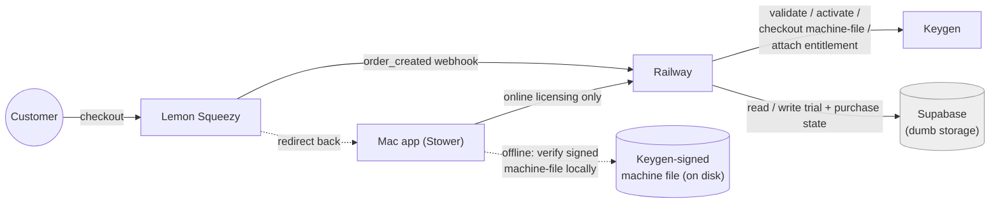
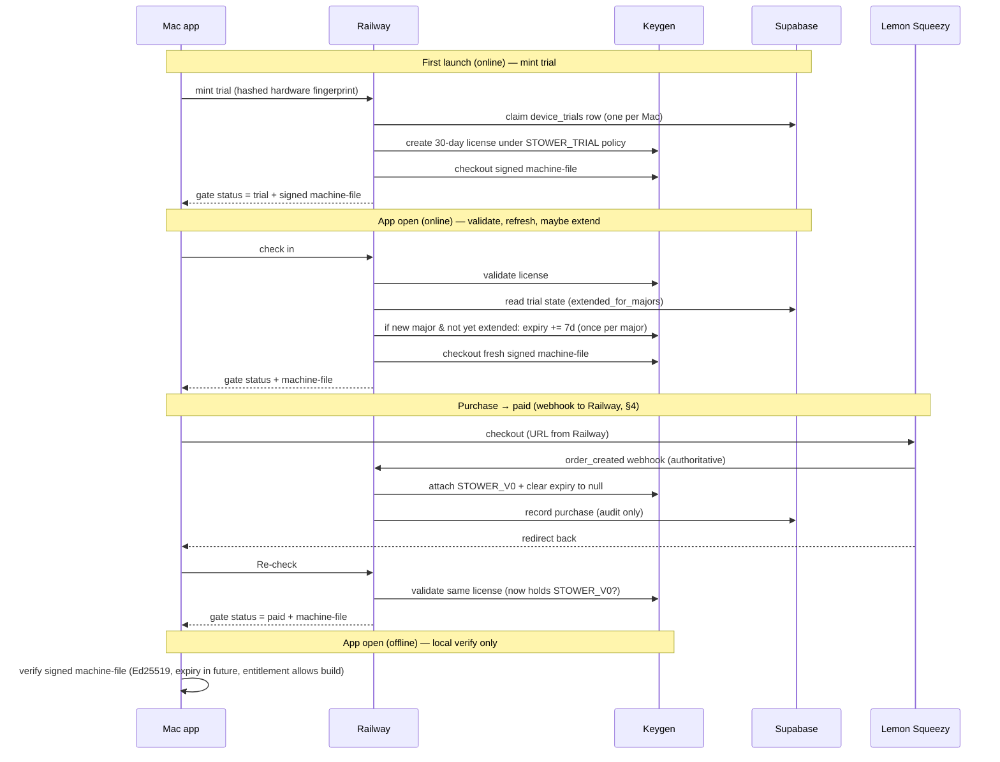

# Stower — License Lifecycle & Runtime Topology

> **What this doc is.** The settled runtime shape of Stower's licensing: who talks
> to whom, who is allowed to reason, and how a license moves through its life
> (trial → paid → offline). Customer-facing terms live in [`licensing.md`](./licensing.md);
> the seam-by-seam engineering contract lives in
> [`licensing-contract.md`](./licensing-contract.md). This doc is the **topology +
> lifecycle** view that sits above both, and is consistent with the contract
> (≥ v1.12) — it does not introduce a different model, it draws the picture.

**Version:** 1.0 · **Last updated:** 2026-06-25 · **Status:** decision locked, code not yet migrated.

---

## 1. The locked decisions

These are firm (Emily, 2026-06-25). A plan or commit that contradicts one is wrong.

1. **The Mac app talks to Railway and nothing else for online licensing.** No
   direct Keygen calls, no direct Supabase calls. Railway is the single
   app-facing surface.
2. **Railway is the only component that reasons.** It owns all runtime license
   logic: mint trial, validate / check in, trial-extension math, machine-file
   checkout, and flipping a trial to paid. Keygen is the authority it calls;
   Supabase is the memory it reads/writes.
3. **Supabase is dumb storage.** Postgres tables only (`device_trials`,
   `purchases`). **No Edge Functions, no webhooks, no logic.** It records what
   happened; it never decides anything.
4. **Webhooks go to Railway, never to Supabase.** The Lemon Squeezy
   `order_created` webhook is received by **Railway**, which acts on it (attaches
   the major's entitlement, clears expiry). Supabase receives no webhooks — that
   is the one and only "no webhook" rule.
5. **Keygen stays the sole license authority.** It mints, signs (Ed25519),
   validates, holds entitlements, and enforces `maxMachines`. Railway never
   reimplements that — it orchestrates it.

---

## 2. The actors

| Actor | What it is | Allowed to reason? |
|-------|-----------|--------------------|
| **Mac app** (`Stower`) | The client. Calls Railway when online; verifies a signed Keygen machine-file locally when offline. | No — it asks and enforces, it doesn't decide. |
| **Railway** | The licensing backend. The only orchestrator. Receives the Lemon Squeezy webhook. | **Yes** — all runtime license reasoning lives here. |
| **Keygen** (CE/cloud) | The license authority. Mints, validates, signs machine-files, holds entitlements, enforces `maxMachines`. | Authority only — it has no rules/scheduling engine. |
| **Supabase** | Postgres state store: `device_trials`, `purchases`. | **No** — dumb storage, no webhooks. |
| **Lemon Squeezy** | Payment processor. Takes money, redirects the customer back, and sends `order_created` **to Railway**. | No — payment only. |

---

## 3. Architecture (static shape)

Read the arrows: every online arrow from the app points at **Railway**. Railway
is the only thing that fans out to Keygen and Supabase, and the only thing the
Lemon Squeezy webhook hits. Supabase has **no inbound arrow except from
Railway** — that's the "dumb storage, no webhooks" invariant made visual.

---

## 4. Purchase → paid: webhook to Railway

A purchase becomes a paid license when **Railway** receives the Lemon Squeezy
`order_created` webhook and acts on it. The webhook hits Railway, not Supabase.

1. Customer clicks Buy → Railway returns a Lemon Squeezy checkout URL.
2. Customer pays at Lemon Squeezy.
3. Lemon Squeezy sends `order_created` **to Railway**. Railway validates the
   event, maps the variant to the Stower major, then on the Keygen license:
   - attaches the major's entitlement (`STOWER_V0`),
   - clears the license expiry to `null` (perpetual),
   - records the purchase row in Supabase (audit only).
   **This webhook is the authoritative mutation** — it is the only thing that
   flips trial → paid.
4. Lemon Squeezy also **redirects the customer back** to the app. The app does
   **not** infer "paid" from that redirect. Instead the app calls Railway
   (`Re-check`), Railway validates the same Keygen license, and if the webhook
   has already attached `STOWER_V0` the app advances off the paywall.
5. If the webhook hasn't landed yet, `Re-check` leaves the user on the paywall;
   they press it again and it completes once the webhook has been processed.

Why the app re-checks instead of trusting the redirect: the redirect is a UI
event the user could reach without paying; the webhook is the signed,
server-to-server truth. Background polling / deep-link auto-advance are
deferred — `Re-check` is the manual trigger.

> Seam-level detail (endpoints, idempotency, `KEYGEN_V0_ENTITLEMENT` fail-loud)
> lives in `licensing-contract.md` §5b "Purchase webhook extension" and invariants
> I7 / I10. This section is the topology; the contract is the contract.

---

## 5. Lifecycle (dynamic behavior over time)

The offline path never touches the network: the app trusts only a Keygen-signed
machine-file whose `meta.expiry` is still in the future and whose entitlements
allow the running major. It cannot mint, extend, or flip to paid offline — those
are Railway-only and require reachability.

---

## 6. Relationship to the contract & current drift

This doc is **consistent with `licensing-contract.md` (≥ v1.12)** — the webhook
already targets Railway there (vendor table, §5b, gap item **G8** "Webhook
attaches `STOWER_V0`"). Nothing in the contract needs to change for this doc.

The drift that remains is **code, not contract**:

- **As-built `supabase/functions/license/`** still hosts both `mint-trial` and
  `ls-webhook` as a Supabase Edge Function — i.e. the webhook currently hits
  **Supabase**, the one thing decision #4 forbids. Plan Beta moves all of it to
  Railway and deletes the Edge Function; the `ls-webhook` route is re-homed on
  Railway, and Supabase is left as pure storage.

`licensing.md` §2 (customer-facing) describes the webhook flipping the license to
paid without naming where it's hosted, so it stays accurate as written.

---

## 7. Open items

- **Plan Beta** is the work that makes this real: stand up the Railway backend,
  re-home `mint-trial` + the Lemon Squeezy webhook on it, and reduce Supabase to
  storage. Tracked in `licensing-contract.md` §5c (gap items G12/G13) — not owned
  by this doc.
