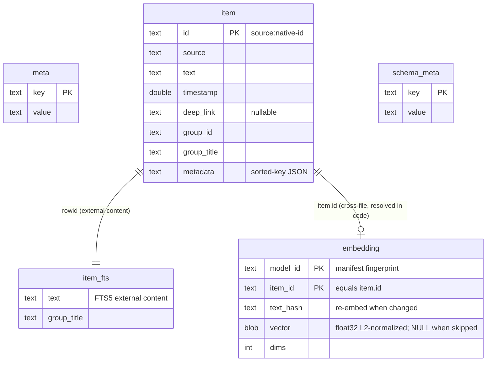

# StowerCore

## Why

Source-agnostic search and index. The model: every adapter (`StowerPhotos`,
`StowerMessages`, future Notes/Calendar/etc.) produces values that conform
to `StowerIndexedItem`. `StowerCore` flattens them into namespaced
`StowerStoredItem` rows and indexes body and group-title text with FTS5.

`StowerCore` must never import `StowerPhotos`, `StowerMessages`, PhotoKit, or
`chat.db`-specific GRDB types. The dependency arrow points *into* this module,
never out of it. This keeps it testable without PhotoKit or `chat.db` in the
loop and lets us add new sources without churn.

## Public API surface

- `StowerIndexedItem` — the eight-field adapter contract: native id, source,
  body, timestamp, metadata, deep link, group id, and group title.
- `StowerIndex` — actor-isolated file-backed or in-memory Index DB with
  rebuild-only ingestion and safe tokenized search.
- `StowerSearchResult` — stored item, marked snippet, and bm25 score, with
  rank-preserving grouping by group id.

## Index design

- `item` is the durable content table. Core namespaces ids as
  `<source>:<native-id>` so adapters cannot collide.
- `item_fts` is an FTS5 external-content table over `text` and `group_title`,
  joined to `item` by SQLite rowid only during keyword search.
- The tokenizer is Porter over Unicode61, providing English stemming and
  diacritic folding.
- Search uses `FTS5Pattern(matchingAllTokensIn:)`, never raw FTS syntax.
- Body text has weight `1.0`; group title has weight `0.25`.
- Ingestion deletes all `item` rows, inserts the new set, and runs FTS
  `rebuild` in one transaction. v1 intentionally has no incremental path.
- A stale `schema_version` erases and recreates the Index DB.

## Data model

Two SQLite files in the index directory. `index.sqlite` is **disposable** —
`replaceAll` rewrites `item` every launch, and a schema bump erases the whole
file. `embeddings.sqlite` is **precious** — it survives both, because re-embedding
180 days is slow. They are never joined in SQL; the retriever resolves
`embedding.item_id` back to `item.id` in code (orphans are dropped).

`meta` + `item` + `item_fts` live in `index.sqlite`; `schema_meta` + `embedding`
live in `embeddings.sqlite`. `embedding`'s primary key is the composite
`(model_id, item_id)`, so a second model never collides with the first.

## Hybrid retrieval

The semantic arm lives alongside FTS5 and is fused by reciprocal-rank fusion:

- **Embedding model**: `BAAI/bge-small-en-v1.5` converted to Core ML
  (`Scripts/convert-embedding-model.py`). The model is swappable: pooling, query
  prefix, dims, max tokens, special-token ids, and the pinned HF revision all
  travel in a `manifest.json` beside the `.mlpackage`, so a swap is a re-embed,
  not a code change. `StowerEmbedder` is the seam; `StowerCoreMLEmbedder` reads
  the manifest. (Resolved: not NLContextualEmbedding, not MLX, for v1.)
- **Embedding storage format**: float32 BLOB, L2-normalized at write so the
  retriever's dot product is cosine similarity. (Resolved: not fp16 — 1.5KB/row
  is acceptable at this scale, and fp16 would add encode/decode at every read.)
- **Embedding cache lives in its own `embeddings.sqlite`**, not the index file.
  The index is disposable (`replaceAll` per launch, schema-version erase); the
  cache is precious (101s to rebuild). Keying on stable `item.id` (never the FTS
  rowid), it survives both. `StowerEmbeddingStore` owns it.
- **Fusion**: `StowerRetriever` brute-force cosine over a once-per-process flat
  vector cache, RRF (`k = 60`, per-arm depth 100), deterministic total order
  (fused score, timestamp, id). Constants live only in `StowerRetriever`.

## Open questions

- Thread-chunk vs message-level embedding — message-level for v1; first suspect
  if the gate fails on context-dependent queries (v1.1 research note).
- fp16 vectors — revisit only if the float32 cache size is actually felt.

## See also

- Plan: `PLAN.md`
- LLM trace schema: `Docs/LocalLLMTrace.md`
- Eval suite: `Docs/EvalSuite.md`
- Apple data-access constraints: `tmp/research/2026-05-12-apple-data-access.md`
