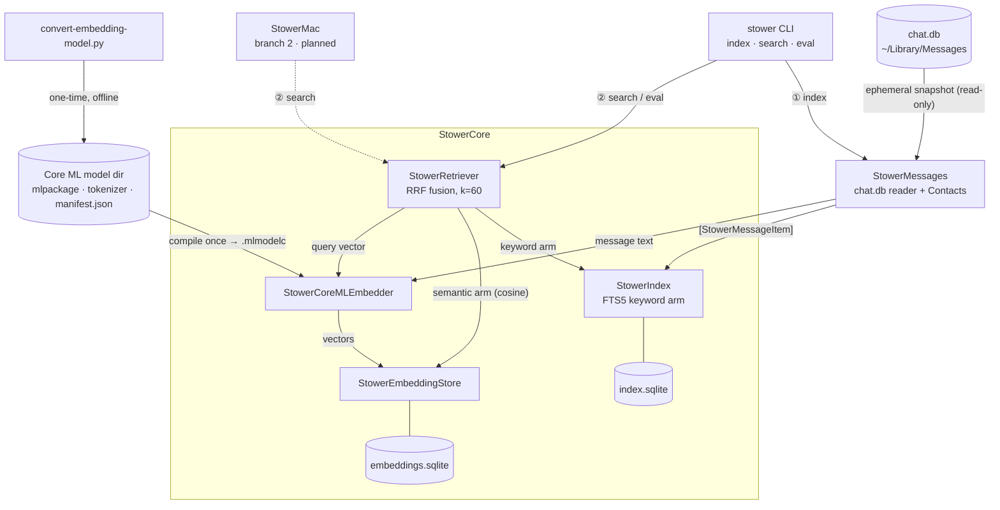

# Stower

Local-first AI recall over your own Apple data. Ask a question by voice or
text — "the ramen place Mom texted me about", "photos from the Tahoe trip" —
and Stower runs a hybrid full-text + embedding search across your Photos and
iMessages, entirely on-device, and hands back the matches with a short
summary. Nothing leaves your Mac.

> **Status: early.** The Messages recall path ships — a hybrid FTS5 + bge-small
> embedding retriever in `StowerCore` and a permanent `stower` CLI
> (index / search / eval). Photos, voice query, and the local-LLM summary are
> still ahead. See [`PLAN.md`](PLAN.md) for the roadmap and current status.

## Architecture

Three library targets, one-directional dependency graph:

- **`StowerCore`** — source-agnostic search, indexing, embeddings, FTS5 store,
  voice pipeline, and the local-LLM wrapper. Knows nothing about its sources.
- **`StowerPhotos`** — PhotoKit + FastVLM caption adapter. Produces
  `IndexedItem` values for `StowerCore`.
- **`StowerMessages`** — `chat.db` reader + Contacts join. Produces
  `IndexedItem` values for `StowerCore`.

`StowerPhotos` and `StowerMessages` depend on `StowerCore`; nothing depends on
them, and they never import each other. This keeps the v3 Photos-only iOS app
from ever linking the Messages code. See [`Docs/`](Docs/) for per-subsystem
rationale.

### System overview

`①` is the index path (write); `②` is the query path (read). Dashed nodes/edges
are planned (not built yet).



## Quickstart

```bash
git clone https://github.com/emilykangdev/stower.git
cd stower

# Build and test (requires Swift 6.3.1+).
swift build
swift test

# Lint gate (requires: brew install swift-format swiftlint).
./Scripts/install-hooks.sh   # one-time: wire precheck.sh to pre-commit
./Scripts/precheck.sh
```

`swift test` uses Swift Testing and needs full Xcode locally; under Command
Line Tools only, run it through `./Scripts/precheck.sh`, which injects the
required framework flags automatically.

## The `stower` CLI (recall over your Messages)

`stower` indexes a window of your local Messages and searches it with a hybrid
of FTS5 keyword matching and bge-small embeddings, fused by reciprocal-rank
fusion. Everything is on-device.

```bash
# 1. Convert the embedding model once (downloads weights from Hugging Face,
#    writes a Core ML package to ~/Library/Application Support/Stower/Models/).
#    Pinned deps run under uv — no ambient-Python roulette.
uv run Scripts/convert-embedding-model.py --model BAAI/bge-small-en-v1.5

# 2. Grant Full Disk Access AND Contacts to your terminal app, in
#    System Settings → Privacy & Security. Full Disk Access requires fully
#    quitting and reopening the terminal afterward to take effect.

# 3. Index the last 180 days, then search. Use a release build for real timings.
swift build -c release
.build/release/stower index --days 180
.build/release/stower search "the pizza place Sam mentioned"
.build/release/stower search "quarterly numbers" --arm fts   # keyword-only, no model needed
```

The model and index default to `~/Library/Application Support/Stower/` so
Conductor worktrees share one conversion and one index. Override with
`--model-path` / `--index-dir`. Re-running `index` embeds only new messages
(the cache survives rebuilds). `stower eval <queries.tsv>` scores a
pre-registered recall set; the query file must be gitignored (it holds personal
queries) — the command refuses a non-ignored in-repo path.

## Contributing

See [`CONTRIBUTING.md`](CONTRIBUTING.md) and [`AGENTS.md`](AGENTS.md) (agent rule
set, imported by `CLAUDE.md`).

## License

[FSL-1.1-MIT](LICENSE) (Functional Source License) — the source is public and
free to read, run, and modify for any purpose **except** building a competing
product. Each release automatically converts to the [MIT License](LICENSE) two
years after it ships.
