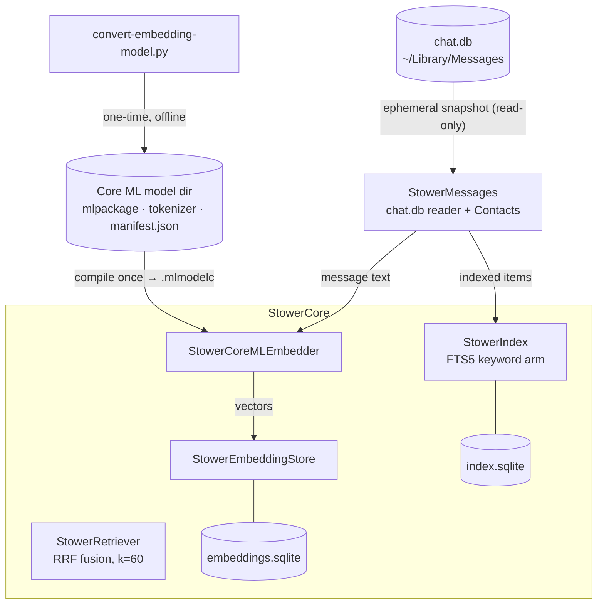

# Stower

Stower is a macOS app that reads your iMessage conversations, entirely
on-device, and surfaces the ones you're letting slip: a real question still
waiting on you (**"Your turn"**), or one you asked that never got answered
(**"Maybe follow up"**). One click copies your saved reply to the clipboard
and deep-links you into the exact conversation in Messages.app, ready to paste
(⌘V) and send — Stower never sends anything itself.

Your message content never leaves your Mac — no server ever sees it. The app
does make a small number of other network calls (anonymous usage-analytics
when opted in, crash reports when opted in, a license check) that carry no
message content; see [`SECURITY.md`](SECURITY.md) for the honest, itemized
breakdown of exactly what leaves the device and what doesn't.

> **Status:** the Messages board, drafts, and deep-link flow are built and
> shipping. A standalone recall CLI and a planned Photos surface live in the
> same monorepo at different maturity levels.

## What it does

- **The board** — surfaces 1:1 iMessage threads that need your attention,
  under two plain-language labels: **"Your turn"** (they asked or answered
  last — a reply is owed) and **"Maybe follow up"** (you asked something real
  and never heard back). The judgment — telling "free Saturday?" apart from
  "lol" — runs on-device via Apple's Foundation Models.
- **Drafts** — write a reply whenever the thought hits you, not only when
  you're in the thread. Stower saves it and shows it across every
  conversation, so a half-written reply is never stuck invisibly in one
  compose field.
- **Deep-link + paste** — one click copies your draft to the clipboard and
  opens the exact conversation in Messages.app, ready for you to paste (⌘V)
  into the compose field and send. Stower is App Sandboxed and cannot post a
  synthetic paste or drive Accessibility, so the paste step is always manual.
  Stower never transmits a message itself.
- **Dismiss / mute**, with undo, for threads or senders you don't want
  surfaced.

Fast hybrid keyword + semantic search over your local message history exists
as a library (`StowerCore`) and a CLI — it is not yet wired into the macOS
app's UI.

## Architecture

Three library targets, one-directional dependency graph:

- **`StowerCore`** — source-agnostic search, indexing, embeddings, FTS5
  store, the on-device judgment model wrapper. Knows nothing about its
  sources.
- **`StowerMessages`** — `chat.db` reader (read-only) + Contacts join.
  Produces indexed items for `StowerCore`. This is what the macOS app is
  built on.
- **`StowerPhotos`** — PhotoKit + FastVLM caption adapter, a scaffold today
  (not part of the shipping product).

`StowerPhotos` and `StowerMessages` depend on `StowerCore`; nothing depends on
them, and they never import each other. The macOS app links `StowerCore` +
`StowerMessages` only.

### On-device model architecture

The on-device model is **not assumed to be Apple's Foundation Models forever.**
A goal is to experiment with and compare several local models (local LLMs/SLMs
run on the user's machine) — Apple's is simply the first one wired up.
Wherever a model produces a result that's cached or acted on, the **model's
identity is part of the contract**, so swapping or A/B-ing local models stays
cheap and never serves a result produced by a different model. The one hard
constraint is **local** — nothing leaves the Mac.

### System overview



## Permissions

Stower needs **Messages access** (to read `~/Library/Messages/chat.db`) and
**Contacts** (to resolve phone numbers to names). These are granted
differently: Contacts uses macOS's normal system permission prompt (Allow /
Don't Allow). Messages access uses a standard "Open" dialog (`NSOpenPanel`) —
the app's onboarding screen walks you through selecting your Messages folder,
which grants Stower read access to only that folder, not your whole disk. See
[`Docs/Permissions.md`](Docs/Permissions.md) for exactly how each is
requested, and [`SECURITY.md`](SECURITY.md) for how that access is scoped and
what it is (and isn't) used for.

## Quickstart (building from source)

```bash
git clone https://github.com/emilykangdev/stower.git
cd stower

# Build and test (requires Swift 6.3.1+).
swift build
swift test

# Lint gate (requires: brew install swift-format swiftlint).
Scripts/install-hooks.sh   # one-time: wire precheck.sh to pre-commit
Scripts/precheck.sh
```

`swift test` uses Swift Testing and needs full Xcode locally; under Command
Line Tools only, run it through `Scripts/precheck.sh`, which injects the
required framework flags automatically.

## CLI reference

The `stower` CLI is a build-from-source developer tool that exercises the
recall engine directly. It indexes a window of your local Messages and
searches it with a hybrid of FTS5 keyword matching and bge-small embeddings,
fused by reciprocal-rank fusion — everything on-device.

```bash
# 1. Convert the embedding model once (downloads weights from Hugging Face,
#    writes a Core ML package to ~/Library/Application Support/Stower/Models/).
uv run Scripts/convert-embedding-model.py --model BAAI/bge-small-en-v1.5

# 2. Grant Contacts to your terminal app, in System Settings → Privacy &
#    Security. Messages access is granted per-run: `stower index` presents
#    its own picker — select ~/Library/Messages when it opens.

# 3. Index the last 180 days, then search.
swift build -c release
.build/release/stower index --days 180
.build/release/stower search "the pizza place Sam mentioned"
.build/release/stower search "quarterly numbers" --arm fts   # keyword-only, no model needed
```

The index defaults to `~/Library/Application Support/Stower/Index/` and the
model to `~/Library/Application Support/Stower/Models/default/`. Override
either with `--index-dir` / `--model-path`. Re-running `index` embeds only
new messages (the cache survives rebuilds).

## What Stower can see

Stower reads the **Mac's** Messages database, so it only knows what the
Messages app on your Mac has — which is not necessarily your whole texting
life:

- **iMessage** (blue bubble) syncs to the Mac automatically via your Apple ID.
- **SMS/MMS/RCS with Android users** (green bubble) is handled by your
  iPhone's cellular radio, *not* Apple's servers. It reaches the Mac only if
  **Text Message Forwarding** is on (iPhone → Settings → Messages → Text
  Message Forwarding → enable your Mac), and only from the moment you enabled
  it — older history is not backfilled.

So if you text Android contacts over SMS without Text Message Forwarding,
those threads are invisible to Stower. Stower reflects your iMessage +
forwarded-SMS world, not every message you've sent.

## Security

See [`SECURITY.md`](SECURITY.md) — an honest accounting of a past credential
exposure and how it was fixed, plus what's structurally built into the app so
there's less to trust in the first place.

## Contributing

Bug reports and questions via
[issues](https://github.com/emilykangdev/stower/issues) are welcome.
Pull requests from outside contributors are not currently accepted.

## License

[PolyForm Noncommercial 1.0.0](LICENSE) — the source is public and free to
read, run, and modify for any **noncommercial** purpose (personal use,
research, education, hobby and nonprofit projects). Any commercial use
requires a separate commercial license from the maintainer.